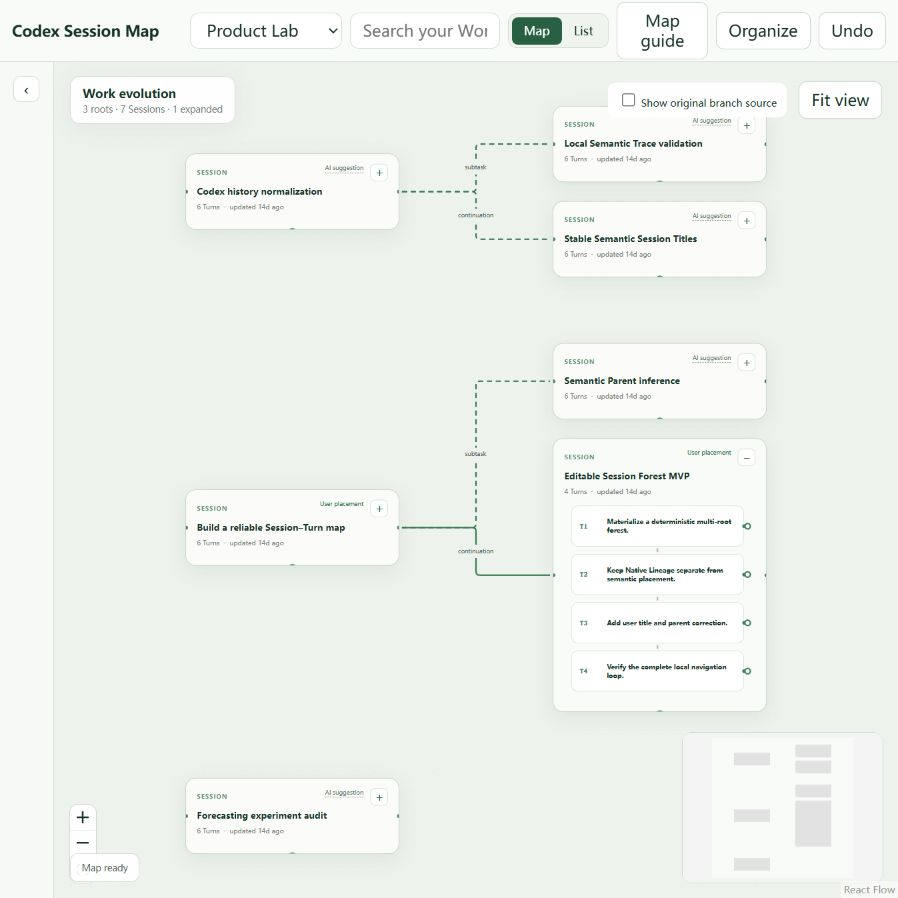

# Codex Session Map

**Turn scattered OpenAI Codex sessions into a searchable, editable map of your work.**

After a project grows to dozens of Codex sessions, a flat history list stops showing how the work evolved. Codex Session Map helps you find old decisions, follow relationships between Sessions and Turns, and organize long-running Codex work without modifying the original Codex history.

Local-first · Read-only Codex history · Searchable · User-editable · AI optional

## See the shape of your work

The default `/` entry is a React Map Workspace. It keeps Session relationships visible, expands a Session into its ordered Turn chain, and lets a child Session branch from the Turn where the work became related. Search and the Turn Reader then take you back to an exact native Turn.



This screenshot uses sanitized demonstration data and shows the current Map Workspace with Session relationships and an expanded Turn chain. The repository also retains the older Forest screenshot as a legacy visual reference.

## Why Codex Session Map?

Codex makes it easy to start a new Session, but long-running work soon becomes scattered across continuations, side investigations, and subtasks. The important decision may be in one Turn, while the Session that followed it has a completely different title.

Codex Session Map turns that history into a structure you can revisit:

```text
Project
├── Main investigation
│   ├── Session A
│   │   ├── Turn 1
│   │   └── Turn 2
│   │       └── Session B
│   └── Session C
└── Another workstream
```

It is designed for finding past work, understanding how Sessions relate, correcting the organization, and returning to the exact discussion that matters.

## What you can do

### Map long-running work

Organize Codex Sessions into an editable multi-root work map. Session chains remain separate from side branches and unorganized history.

### Find anything again

Search the current Workspace and jump from a result to the exact Session and native Turn that contains it.

### Read work in context

Expand a Session into its ordered Turn sequence, open the full Turn content, and move to neighboring Turns without loading an entire transcript into the page.

### Organize it yourself

Rename Sessions, edit Turn labels, move Sessions, set roots, attach a Session to a specific Turn, restore automatic suggestions, and undo recent manual changes. User corrections remain authoritative.

### Let AI help — optionally

Local Ollama can suggest Turn traces, Session titles, and relationships. Manual organization, browsing, Search, and Reader do not require the model.

Codex source history is opened read-only throughout these flows.

## More than a transcript viewer

Typical transcript viewers help inspect individual Sessions. Codex Session Map focuses on organizing long-running work across Sessions while keeping the original history intact.

| Capability | Basic transcript/session viewer | Codex Session Map |
| --- | --- | --- |
| Read past transcripts | ✓ | ✓ |
| Search history | often | ✓ |
| Browse Sessions | ✓ | ✓ |
| Editable cross-Session work map | — | ✓ |
| Attach a Session to a specific Turn | — | ✓ |
| User-correctable relationship structure | — | ✓ |
| Multi-root long-running Workspace organization | — | ✓ |

## Quick Start

The verified Beta path is Windows with Node.js 24 or newer:

```powershell
git clone https://github.com/LghLearning/codex-session-map.git
cd codex-session-map
corepack enable
pnpm install --frozen-lockfile
.\start-session-map.ps1
```

Open [http://127.0.0.1:4319](http://127.0.0.1:4319) if the launcher does not open the browser. The default page is the React Map Workspace; the retained legacy Explorer is available at `/legacy`.

Ollama is optional. Map, Search, Reader, and manual organization work without AI. Add Ollama only when you want local generation:

```text
ollama pull qwen3.5
ollama serve
```

Useful launcher options include `-NoBrowser`, `-Fallback`, `-Port 4321`, and `-NodePath C:\path\to\node.exe`.

## How it works

The user-facing model is simple:

```text
Workspace
  → Sessions
    → ordered Turns
      → child Session branches
```

Each Turn keeps a stable native identity. Its displayed label can come from a user label, an AI trace, or a public input preview. A Session's display title follows the same user-first rule. Native Lineage records how Codex created Sessions; Semantic placement records how you choose to organize them, and the two remain separate.

The default map is backed by a local read-only source adapter, a rebuildable local Search index, an app-owned semantic store, and a deterministic Session Forest. Filesystem watchers improve update latency while periodic reconciliation remains the correctness path.

## AI is optional

The application uses a local Ollama endpoint at `http://127.0.0.1:11434` with `qwen3.5` when generation is enabled. There is no remote model fallback. If Ollama is unavailable, the application still exposes the source history, map, Search, Reader, manual edits, and Undo.

AI records are suggestions. User titles, labels, placements, and review decisions are durable local state and take precedence over later AI regeneration.

## Data & privacy

Codex sources are opened read-only. The application does not resume, fork, archive, rename, delete, or modify Codex Sessions, rollout files, or the Codex source database. No remote service or cloud account is required.

Application-owned state is kept under `.codex-session-map/`:

```text
.codex-session-map/
├── semantic-traces.sqlite   # AI records and authoritative user edits
├── organization.sqlite      # local organization job state
├── search.sqlite            # rebuildable Workspace Search index
└── source-registry.sqlite   # rebuildable source metadata
```

Search and source metadata can be rebuilt. User overrides in `semantic-traces.sqlite` are authoritative and should be backed up. Stop the application and copy the entire `.codex-session-map/` directory to back up local state.

## Requirements and Beta support

- **Verified Beta path:** Windows.
- **Runtime:** Node.js 24 or newer.
- **Package manager:** pnpm 11.19.0 through Corepack.
- **Source:** an existing local Codex installation with Session history.
- **AI:** optional Ollama and `qwen3.5`.

Linux and macOS watcher behavior is not yet verified. The application is currently released as `v0.2.0-beta.1`.

## Known limitations

- Codex currently reports `openSession=false` and `openTurn=false`; the companion transcript and Copy Session ID are the supported read-only fallback.
- Semantic Parent inference can fail closed when a model result falls outside the legal candidate set. Rerunning retries only missing records.
- Reparenting uses a dialog rather than drag-and-drop.
- Sessions without an AI or user placement remain explicitly Unorganized rather than being silently treated as Roots.
- When Ollama is offline, manual titles, labels, relationships, and Undo remain available. Generation is disabled; restart after restoring Ollama to enable it again.
- Large cold Workspace materialization can take several seconds.
- Workspace organization does not generate missing Turn Traces.
- A first Search on a new Workspace may show incomplete coverage while the local index catches up.
- Non-Windows watcher behavior is unverified.
- Undo history begins with edits made through the current manual controls; pre-upgrade actions are not reconstructed as undoable history.

## Architecture

```text
Codex App Server (preferred)
  → structured SQLite fallback
  → segmented rollout reconciliation
  → CodexAdapter
  → WorkspaceScope → Session → native Turn
  → application semantic store
  → deterministic editable Session Forest
  → local web companion
```

The adapter preserves full public Turn content, stable native Turn identity, archives, hidden-agent state, segmented rollouts, and Native Lineage. Derived semantic records and Search documents are local and rebuildable; the original Codex history remains the source of truth.

See [Architecture](docs/architecture.md), [Source precedence](docs/source-precedence.md), and [Operations and recovery](docs/operations.md) for implementation and recovery details.

## Development

```text
pnpm test
pnpm inspect
pnpm benchmark:transcript
pnpm benchmark:reconciliation
```

The repository uses Node 24 and pnpm 11.19.0. The public snapshot excludes local databases, user corrections, private conversation content, and real-session evaluation reports. The included screenshot and test fixtures use synthetic demonstration data.

## Release notes

See [CHANGELOG.md](CHANGELOG.md) for the `v0.2.0-beta.1` release notes. The Beta includes the React Map Workspace, Search and exact Turn Reader, independent user overrides and Undo, Turn-anchored branches, progressive local organization, Windows/Node 24 hardening, and clearer offline/indexing states.
