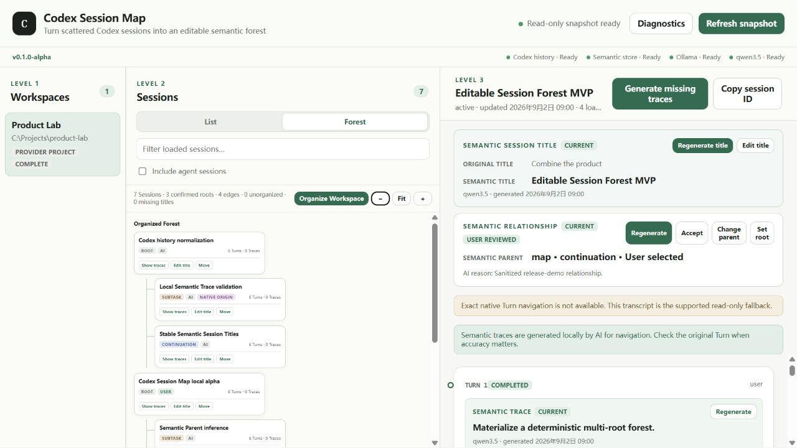

# Codex Session Map

Codex Session Map turns scattered Codex sessions into an editable semantic forest.

```text
Turn Semantic Traces
  → Semantic Session Titles
  → Semantic Parent Relationships
  → Editable Session Forest
```

Codex history remains read-only. AI metadata and user corrections are stored locally in a separate application database.



## What it does

- Groups local Codex Sessions by Workspace.
- Reconstructs native Turns, tools, archives, segmented rollouts, and Native Lineage.
- Generates concise Simplified-Chinese Turn traces with local Ollama/qwen3.5.
- Generates stable Session titles and continuation/subtask/root relationships.
- Organizes one explicitly selected Workspace into a multi-root Forest.
- Keeps Unorganized Sessions separate from confirmed semantic Roots.
- Lets the user rename Sessions, edit Turn labels, change parents, or set a Session as Root without generating AI suggestions first.
- Supports Restore automatic and revision-protected Undo for manual edits.
- Preserves the original transcript beside all generated metadata.

Native Lineage records how Codex Sessions were created. Semantic placement records how those Sessions relate as work. They remain separate.

## Requirements

- Windows 10/11 for the verified alpha path. Linux/macOS watcher behavior is not yet verified.
- Node.js 24 or newer.
- A local Codex installation with existing Session history.
- Optional for AI generation: [Ollama](https://ollama.com/) and `qwen3.5`.

History browsing, Forest data, and manual organization remain available when Ollama is offline. Only AI generation requires the model.

## Recent updates

- Full Turn content now preserves long text, whitespace, and formatting independently of bounded previews. Displayed Turn numbers remain consecutive across pagination, and native Turn IDs support exact reads.
- Derived fingerprints detect full-content changes, including text outside AI prompt samples. Older cached suggestions may appear stale after upgrading; stored suggestions and user values are retained.
- User titles, Turn labels, and parent placement are persisted independently of AI records. Manual parent selection covers all legal Sessions in the Workspace, with time-direction and cycle checks.
- Undo checks the current revision before restoring a previous user value. Restore automatic clears an override while retaining the AI suggestion. Ctrl+Z inside text inputs keeps the browser's text-editing behavior.
- Forest trace content and counts update as generation completes, without reloading the page. Trace cards now follow the active color theme.

Restart the server after updating. The application upgrades its local semantic database from schema 4 to 5 transactionally, preserving existing user titles, parent choices, trace edits, and review states. No Codex source database is modified.

## Installation

Clone or download this repository, then run:

```powershell
git clone https://github.com/LghLearning/codex-session-map.git
cd codex-session-map
corepack enable
pnpm install --frozen-lockfile
```

No Electron, Tauri, installer framework, remote service, or cloud account is required.

## Start

The Windows launcher validates Node, starts the loopback-only server, waits for readiness, and opens the local UI:

```powershell
.\start-session-map.ps1
```

Useful options:

```powershell
.\start-session-map.ps1 -NoBrowser
.\start-session-map.ps1 -Fallback
.\start-session-map.ps1 -Port 4321
.\start-session-map.ps1 -NodePath C:\path\to\node.exe
```

Or start directly:

```text
pnpm start
pnpm start:fallback
```

The default URL is `http://127.0.0.1:4319`. It opens the React Map Workspace; the previous Explorer remains available at `/legacy` during the migration.

## Organize a Workspace

1. Select a Workspace.
2. Open the Map Workspace, or use the legacy **Forest** view.
3. Click **Organize** / **Organize Workspace**.
4. Review the generated titles and relationships.
5. Use **Rename**, **Edit label**, **Change parent**, or **Set root** to organize directly, even without AI results. **Restore automatic** clears your override; **Undo** reverses your recent manual change.

Organization is explicit, current-Workspace-only, cancellable, and safe to rerun. It reuses existing titles and parents, preserves user corrections, continues after individual Session failures, and never starts full-history Turn Trace generation.

## Local Ollama setup

```text
ollama pull qwen3.5
ollama serve
```

Runtime contract:

```text
Endpoint: http://127.0.0.1:11434
Model: qwen3.5
Thinking: OFF
Temperature: 0
Remote fallback: none
```

The startup status bar and Diagnostics show whether history, the semantic store, Ollama, and the model are ready.

## Data and privacy

Codex sources are opened read-only. The application does not resume, fork, archive, rename, delete, or modify Codex Sessions.

Application-owned data lives under:

```text
.codex-session-map/
└── semantic-traces.sqlite
```

The database contains Semantic Traces, Semantic Session Titles, Semantic Parent records, and authoritative user corrections. AI records are derived; user edits are not disposable cache data.

To back it up, stop the application and copy the entire `.codex-session-map/` directory.

## Architecture

```text
Codex App Server (preferred)
  → structured SQLite fallback
  → segmented rollout reconciliation
  → CodexAdapter
  → WorkspaceScope → Session → native Turn
  → application semantic store
  → deterministic editable Session Forest
  → local web companion
```

Filesystem watchers reduce update latency. Periodic reconciliation remains the correctness path.

## Known limitations

- This is `v0.1.0-alpha`, intended for local evaluation rather than unattended operation.
- Codex currently reports `openSession=false` and `openTurn=false`; the companion transcript and Copy Session ID are the supported fallback.
- Semantic Parent inference can fail closed when the model returns a Session outside the candidate set. Rerunning retries only missing records.
- Reparenting uses a dialog rather than drag-and-drop.
- Sessions without an AI or user placement remain explicitly Unorganized; they are not silently treated as user-confirmed Roots.
- When Ollama is offline, manual titles, labels, relationships, and Undo remain available. Generation is disabled; restart after restoring Ollama to enable it again.
- Large cold Workspace materialization can take several seconds.
- Workspace organization does not generate missing Turn Traces.
- Non-Windows watcher behavior is unverified.
- Undo history starts with edits made through the new manual controls; pre-upgrade actions are not reconstructed as undoable history.

## Development

```text
pnpm test
pnpm inspect
pnpm benchmark:transcript
pnpm benchmark:reconciliation
```

See [Architecture](docs/architecture.md) and [Source precedence](docs/source-precedence.md) for implementation details.

This public repository starts from a privacy-reviewed source snapshot. Internal development history, real-session evaluation reports, local databases, user corrections, and private conversation content are deliberately excluded. The screenshot and test fixtures use synthetic demonstration data.
